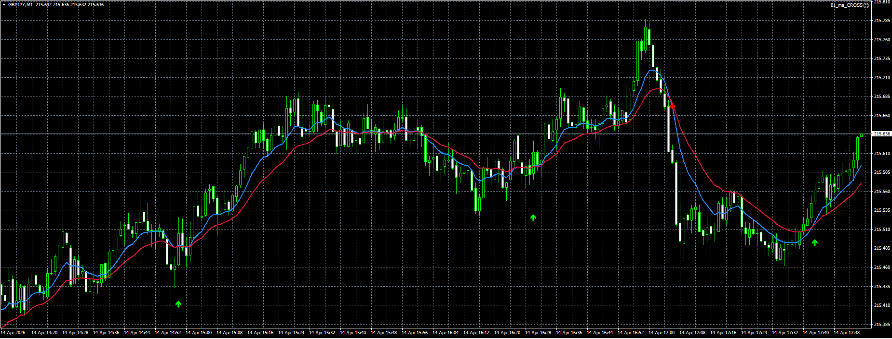

# Moving Average Crossover Expert Advisor

Professional MT4/MT5 Expert Advisor based on fast and slow moving average crossover logic.

## Features
- configurable fast and slow MA periods
- buy/sell crossover entries
- optional trend filter
- stop loss and take profit
- trailing stop support
- clean modular architecture
- optimized for easy strategy customization

## Strategy Logic
The EA opens buy positions when the fast moving average crosses above the slow moving average, and sell positions on bearish crossovers.

It includes spread checks, safe order execution, and modular trade management.

## Portfolio Notes
This project is part of a professional Expert Advisor portfolio covering breakout, RSI, session, and basket/grid strategies.
## Screenshot

