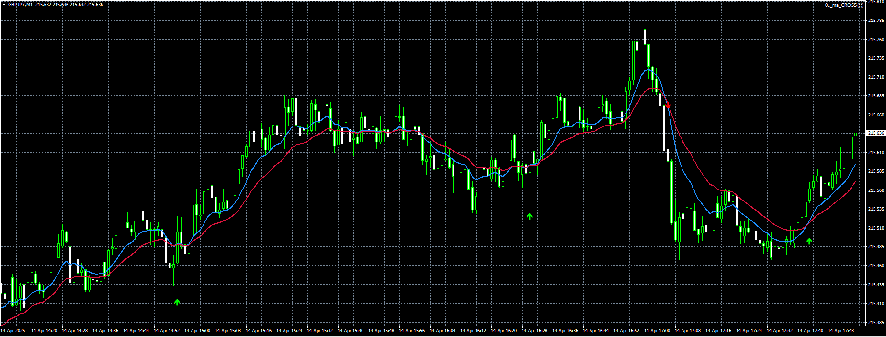
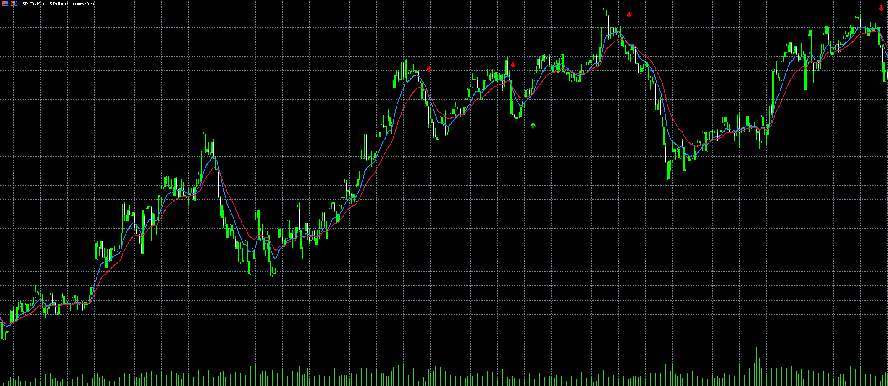

# Moving Average Crossover Expert Advisor

**Category:** Trend Following

---

## Overview

This Expert Advisor implements a classic moving average crossover strategy, where trading signals are generated when a fast moving average crosses a slow moving average.

The project is part of a broader portfolio of MetaTrader Expert Advisors designed with a focus on **modularity, reusable architecture, and robust execution logic**.

---

## Platforms

**Platforms:** MQL4 / MQL5

**Status**

* MQL4: original implementation
* MQL5: refactored using shared framework

---

## Features

* Fast and slow moving average crossover signals
* Configurable moving average periods and types
* Optional trade management features (SL, TP, trailing, break-even)
* Spread, time, and execution filters
* Reusable architecture shared across multiple EAs

---

## Strategy Logic

* A **BUY signal** is generated when the fast MA crosses above the slow MA
* A **SELL signal** is generated when the fast MA crosses below the slow MA

Optional filters and confirmations can be applied before opening trades.

---

## Demo Code

This repository includes a simplified demo version focused on signal logic:

* [`demo_signal_logic_MA_CROSS.mq4`](./demo_signal_logic_MA_CROSS.mq4)

The demo version illustrates how crossover conditions are detected, without including full trade management and execution logic.

---

## MQL5 Version

This Expert Advisor has been refactored into MQL5 using a shared framework designed to improve execution reliability and code maintainability.

### Key improvements include:

* CTrade-based execution model
* Moving average handles with `iMA` and `CopyBuffer`
* Reliable crossover detection using buffered values
* Consistent position tracking using Magic Number + Symbol
* Separation between signal logic, execution, and management
* Improved robustness compared to the original MQL4 version

The MQL5 version is structured to support further extensions and custom features more easily.

---

## Shared Framework Highlights

The MQL5 version is built on a reusable framework shared across the portfolio:

* Unified trade execution using `CTrade`
* Broker stop-level validation and safety buffers
* Spread, time, and equity protection filters
* Safe order send logic with retry handling
* Modular structure for signals, execution, and trade management

---

## Screenshots

### MQL4 Example

### MQL5 Version

---

## Notes

This repository represents a **public showcase version** of the project.

The full version may include additional:

* trade management logic
* risk control features
* optimizations and extensions

---

## Disclaimer

This software is for educational and demonstration purposes only.
Trading involves risk, and past performance does not guarantee future results.

