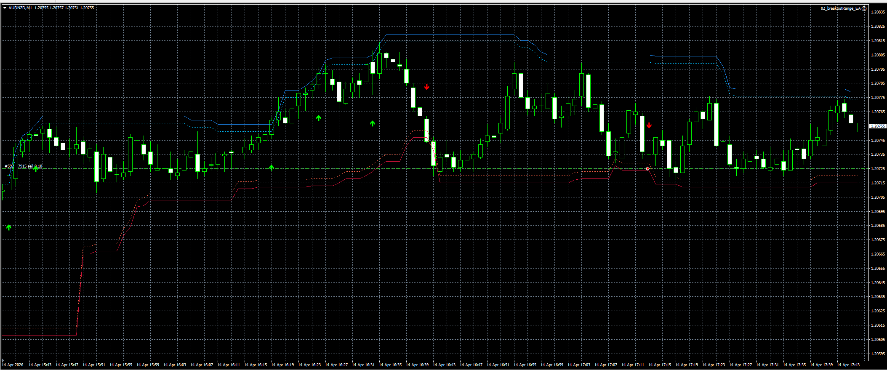

# Range Levels Breakout Expert Advisor

Professional MT4/MT5 Expert Advisor designed to trade breakout movements from dynamically calculated intraday range levels.

## Features
- automatic high/low range detection
- breakout buy and sell entries
- dynamic upper and lower breakout zones
- optional retest confirmation
- stop loss and take profit management
- breakout invalidation filters
- modular risk and execution architecture

## Strategy Logic
The EA continuously calculates breakout zones from recent price action highs and lows.

A buy position is triggered when price breaks above the upper resistance level, while sell positions activate on bearish downside breaks below support.

The architecture supports spread filtering, safe execution, and reusable level-based trade management.

## Portfolio Notes
This project is part of a professional Expert Advisor portfolio covering moving average crossover, session breakout, RSI mean reversion, and basket/grid systems.

## Demo Code
A simplified public demo of the breakout signal logic is available here:

- [demo_signal_logic.mq4](./demo_signal_logic_RANGE_BREAKOUT.mq4)

This repository includes a compilable MQL4 breakout-logic demo for technical portfolio verification.

The chart visualization shown below belongs to the full production version and is intentionally excluded from the public demo source.

## Screenshot

