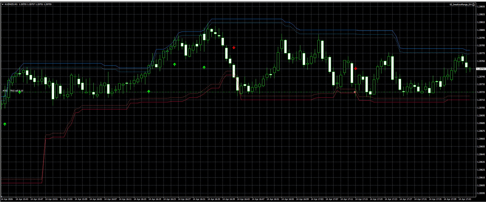
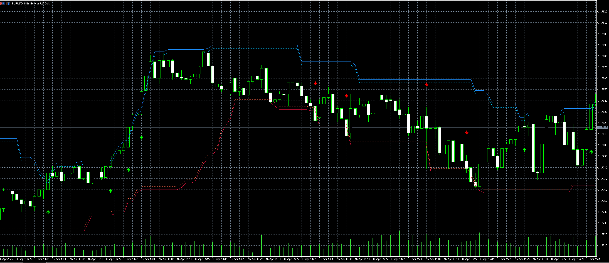

# Range Breakout Expert Advisor

**Category:** Breakout

---

## Overview

This Expert Advisor implements a dynamic range breakout strategy, where trades are opened when price breaks above or below a defined range.

The system identifies a recent price range and reacts to breakout conditions, with optional filters and trade management features.

This project is part of a broader portfolio focused on **modular EA design, reusable components, and robust trade execution**.

---

## Platforms

**Platforms:** MQL4 / MQL5

**Status**

* MQL4: original implementation
* MQL5: refactored using shared framework

---

## Features

* Dynamic range detection based on recent price action
* Breakout entry logic for both upward and downward moves
* Optional breakout confirmation filters
* Configurable cooldown between trades
* Shared trade management (SL, TP, trailing stop, break-even)
* Spread, time, and execution filters
* Modular structure aligned with shared EA framework

---

## Strategy Logic

* The EA calculates a price range based on recent candles
* A **BUY trade** is triggered when price breaks above the upper range boundary
* A **SELL trade** is triggered when price breaks below the lower range boundary
* Optional filters can be applied to avoid false breakouts

Additional logic may include cooldown periods and confirmation conditions before entering new trades.

---

## Demo Code

This repository includes a simplified demo version focused on breakout detection logic:

* [`demo_signal_logic_RANGE_BREAKOUT.mq4`](./demo_signal_logic_RANGE_BREAKOUT.mq4)

The demo version shows how range boundaries and breakout conditions are calculated, without including full trade execution and risk management logic.

---

## MQL5 Version

This Expert Advisor has been refactored into MQL5 using a shared framework designed to improve execution reliability and maintainability.

### Key improvements include:

* CTrade-based execution system
* Range calculation using price series and structured data access
* Breakout detection using buffered price values
* Improved control over breakout states and trade timing
* Consistent position tracking using Magic Number + Symbol
* Clear separation between:

  * range calculation
  * breakout detection
  * execution logic
  * trade management

The MQL5 version provides a more robust and extensible structure for further customization.

---

## Shared Framework Highlights

The MQL5 version leverages a reusable framework shared across all EAs in this portfolio:

* Unified trade execution via `CTrade`
* Broker stop-level validation and safety buffers
* Spread, time, and equity protection filters
* Safe order send logic with retry handling
* Modular architecture separating signals, execution, and management

---

## Screenshots

### MQL4 Example

### MQL5 Version

---

## Notes

This repository represents a **public showcase version** of the project.

The full version may include additional:

* breakout confirmation logic
* advanced filtering conditions
* optimized execution and management features

---

## Disclaimer

This software is for educational and demonstration purposes only.
Trading involves risk, and past performance does not guarantee future results.
