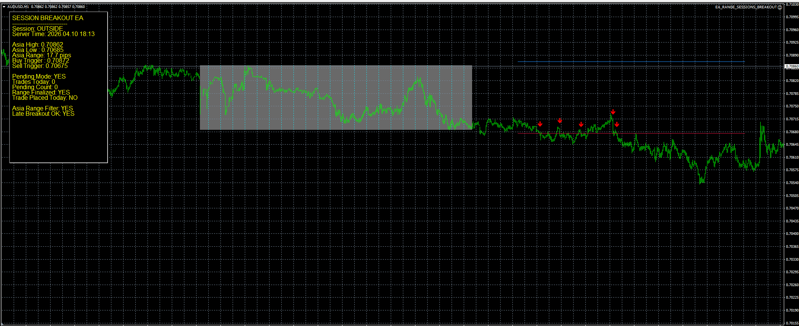

# Asian Session Breakout Expert Advisor

Professional MT4/MT5 Expert Advisor specialized in trading breakout moves from the Asian session price range.

## Features
- automatic Asian session high/low detection
- session box visualization
- London breakout entries
- buy and sell breakout triggers
- late breakout filters
- daily trade limiter
- spread and volatility checks
- clean modular execution architecture

## Strategy Logic
The EA tracks the full Asian session range and automatically builds breakout levels from the session high and low.

Once the London session opens, it monitors for bullish or bearish breakout confirmation beyond the defined Asian range.

The strategy includes breakout validation, late entry protection, and reusable session-based risk management.

## Portfolio Notes
This project is part of a professional Expert Advisor portfolio covering moving average crossover, breakout levels, RSI mean reversion, and basket/grid systems.

## Demo Code
A simplified public demo of the session breakout signal logic is available here:

- [demo_signal_logic.mq4](./demo_signal_logic_ASIAN_BREAKOUT.mq4)

This repository includes a compilable MQL4 session-breakout demo for technical portfolio verification.

The chart visualization shown below belongs to the full production version and is intentionally excluded from the public demo source.

## Screenshot

