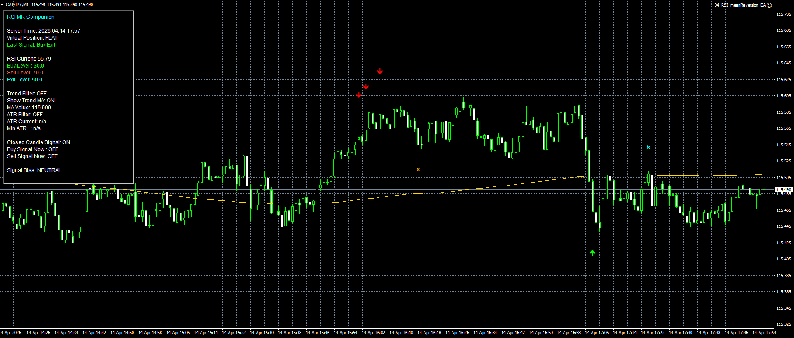

# RSI Mean Reversion Expert Advisor

Professional MT4/MT5 Expert Advisor built around RSI-based overbought and oversold mean reversion logic.

## Features
- RSI oversold and overbought entries
- configurable buy, sell, and exit thresholds
- optional moving average trend filter
- ATR volatility filter support
- reversal confirmation logic
- modular exit and risk architecture
- spread-safe execution checks

## Strategy Logic
The EA monitors RSI extremes and detects temporary market imbalances.

Buy trades are opened when RSI reaches oversold zones and price shows reversal confirmation, while sell positions trigger on overbought conditions.

The strategy supports optional trend bias filtering, ATR-based volatility protection, and clean reusable trade management logic.

## Portfolio Notes
This project is part of a professional Expert Advisor portfolio covering moving average crossover, breakout levels, Asian session breakout, and basket/grid systems.

## Demo Code
A simplified public demo of the RSI signal logic is available here:

- [demo_signal_logic.mq4](./demo_signal_logic_RSI_MEAN_REVERSION.mq4)

This repository includes a compilable MQL4 mean-reversion demo for technical portfolio verification.

The chart visualization shown below belongs to the full production version and is intentionally excluded from the public demo source.

## Screenshot

