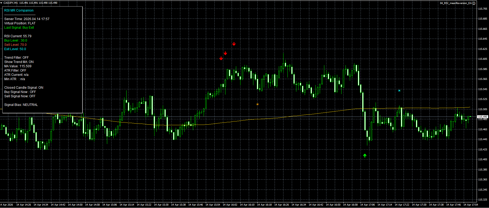
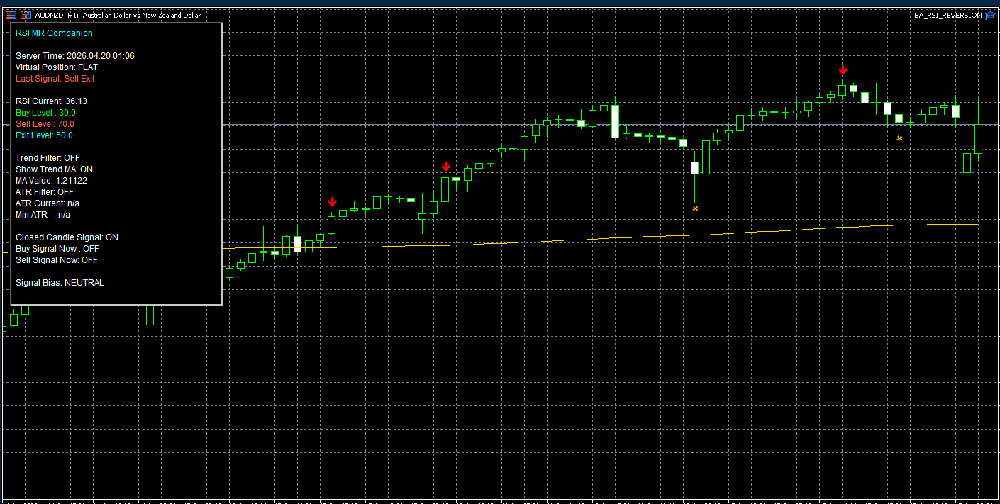

# RSI Mean Reversion Expert Advisor

**Category:** Mean Reversion

---

## Overview

This Expert Advisor implements a mean reversion strategy based on the Relative Strength Index (RSI).

Trades are opened when the market reaches overbought or oversold conditions, aiming to capture price reversals toward equilibrium.

This project is part of a broader portfolio focused on **modular EA design, reusable components, and robust execution logic**.

---

## Platforms

**Platforms:** MQL4 / MQL5

**Status**

* MQL4: original implementation
* MQL5: refactored using shared framework

---

## Features

* RSI-based entry signals
* Configurable overbought and oversold levels
* Optional trend filter (Moving Average)
* Optional volatility filter (ATR)
* Stop Loss and Take Profit management
* Break-even and trailing stop logic
* Spread, time, and execution filters
* Modular structure aligned with shared EA framework

---

## Strategy Logic

* A **BUY trade** is opened when RSI crosses below the oversold threshold and starts reverting upward
* A **SELL trade** is opened when RSI crosses above the overbought threshold and starts reverting downward

Optional filters can be applied:

* Trend filter to avoid counter-trend trades
* ATR filter to ensure sufficient market volatility

The strategy is designed to capture short-term reversals rather than long-term trends.

---

## Demo Code

This repository includes a simplified demo version focused on RSI signal logic:

* [`demo_signal_logic_RSI.mq4`](./demo_signal_logic_RSI_MEAN_REVERSION.mq4)

The demo version illustrates how RSI-based entry conditions are detected, without including full trade execution, filters, and risk management logic.

---

## MQL5 Version

This Expert Advisor has been refactored into MQL5 using a shared framework designed to improve execution reliability and maintainability.

### Key improvements include:

* CTrade-based execution system
* RSI handle with `iRSI` and buffer access via `CopyBuffer`
* Reliable signal detection using closed candle logic
* Improved integration of filters (trend and volatility)
* Consistent position tracking using Magic Number + Symbol
* Separation between:

  * signal logic
  * execution
  * trade management

The MQL5 version provides a cleaner and more extensible structure compared to the original MQL4 implementation.

---

## Shared Framework Highlights

The MQL5 version leverages a reusable framework shared across all EAs in this portfolio:

* Unified trade execution via `CTrade`
* Broker stop-level validation and safety buffers
* Spread, time, and equity protection filters
* Safe order send logic with retry handling
* Modular architecture separating signals, execution, and management

---

## Screenshots

### MQL4 Example

### MQL5 Version

---

## Notes

This repository represents a **public showcase version** of the strategy.

The focus is on demonstrating:

* strategy structure
* signal logic
* framework integration

while keeping the implementation clean and modular.

---

## Disclaimer

This software is for educational and demonstration purposes only.
Trading involves risk, and past performance does not guarantee future results.

