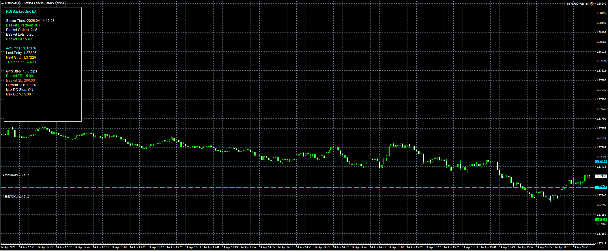

# RSI Basket Grid Expert Advisor

Professional MT4/MT5 Expert Advisor combining RSI reversal logic with basket and grid-based position management.

## Features
- RSI-driven basket entries
- configurable grid step levels
- dynamic lot scaling
- basket average price calculation
- take profit on full basket recovery
- max drawdown protection
- max DD percentage limiter
- modular basket execution engine

## Strategy Logic
The EA opens an initial basket entry when RSI reversal conditions are met.

If price continues against the first position, the system automatically deploys additional grid entries at predefined distance levels.

The full basket is managed using average entry price, global take profit recovery logic, and drawdown protection safeguards.

This architecture is designed for controlled recovery systems with reusable modular basket logic.

## Portfolio Notes
This project is part of a professional Expert Advisor portfolio covering moving average crossover, breakout levels, Asian session breakout, and RSI mean reversion systems.

## Technical Note
Due to the proprietary basket management, average price recovery, and dynamic grid execution architecture used in the full production version, the source code demo is intentionally not included in the public repository.

This portfolio entry focuses on strategy design, chart visualization, system structure, and recovery workflow concepts, while the full basket execution engine, risk controls, and drawdown protection framework remain private.

## Screenshot

