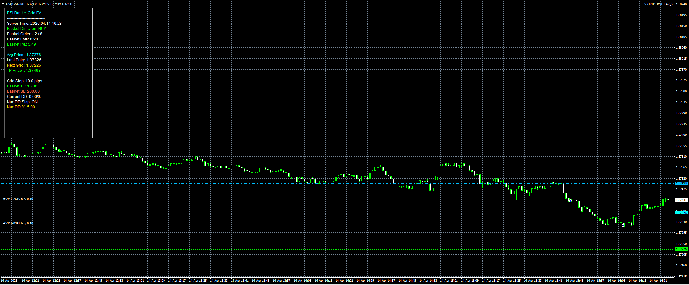
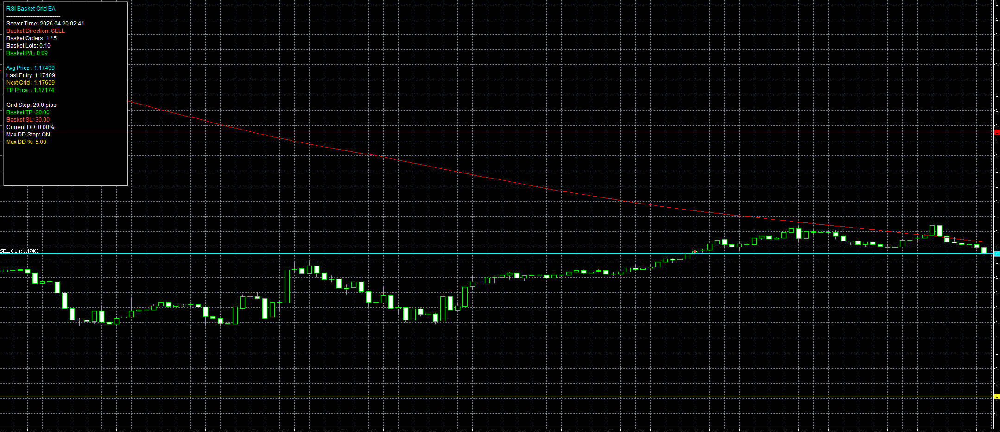

# RSI Basket Grid Expert Advisor

**Category:** Basket / Grid / Recovery

---

## Overview

This Expert Advisor implements a basket-based grid strategy with an RSI-triggered initial entry.

The system combines **mean reversion logic** with **grid expansion and basket management**, allowing multiple positions to be layered and managed as a single unit.

This project represents one of the more advanced systems in the portfolio, focusing on:

* multi-position handling
* basket-level risk management
* dynamic average price calculation
* controlled grid expansion

This system emphasizes **basket-level management rather than individual trade logic**.

---

## Platforms

**Platforms:** MQL4 / MQL5

**Status**

* MQL4: original implementation
* MQL5: refactored using shared framework

---

## Features

* RSI-based initial trade trigger
* Optional trend filter (Moving Average)
* Optional volatility filter (ATR)
* Grid-based position expansion
* Configurable grid step distance
* Maximum number of basket orders
* Basket take profit (money-based)
* Basket stop loss (money-based)
* Maximum drawdown protection
* Dynamic average price calculation
* Next grid level calculation

### Chart Visualization

* Average Price Line
* Next Grid Entry Line
* Basket Take Profit Line
* Info Panel with real-time basket data

---

## Strategy Logic

### Entry

* A trade is opened based on RSI crossing predefined levels:

  * **BUY** when RSI crosses below the oversold threshold
  * **SELL** when RSI crosses above the overbought threshold

Optional filters:

* Trend filter (price relative to MA)
* ATR filter (minimum volatility threshold)

---

### Grid Expansion

* Additional positions are opened if price moves against the initial trade
* Each new order is placed at a fixed distance (`GridStepPips`)
* Grid expansion continues until `MaxBasketOrders` is reached

---

### Basket Management

All positions are managed as a **single basket**:

* Profit is calculated in account currency
* The basket is closed when:

  * Target profit is reached
  * Maximum loss threshold is reached
  * Maximum drawdown condition is triggered

---

### Price Calculations

* **Average price** is recalculated dynamically across all open positions
* **Next grid level** is derived from the latest entry price
* **Basket TP price** is computed based on:

  * total lot size
  * symbol tick value
  * target profit in money

---

## MQL5 Version

This Expert Advisor has been refactored into MQL5 using a shared framework designed for advanced multi-position handling and safer execution.

### Key improvements include:

* CTrade-based execution system
* Robust position tracking using Magic Number + Symbol
* Accurate basket profit calculation including swap and commission
* Reliable average price computation across multiple positions
* Conversion of money-based targets into price levels
* Clear separation between:

  * signal logic
  * grid logic
  * basket management
  * execution layer

The MQL5 version is significantly more structured and maintainable compared to the original MQL4 implementation.

---

## Shared Framework Highlights

The MQL5 version is built on a reusable framework shared across the portfolio:

* Unified trade execution via `CTrade`
* Broker stop-level validation and safety buffers
* Spread, time, and equity protection filters
* Safe order send with retry handling
* Consistent trade tracking system
* Modular architecture for strategy logic and management

---

## Chart Visualization

The EA includes chart objects to support monitoring and debugging:

* **Average Price Line** → current basket average
* **Next Grid Line** → next potential entry level
* **Basket TP Line** → target level for basket closure
* **Info Panel** → displays:

  * basket direction
  * number of positions
  * total lots
  * current profit/loss
  * next grid level
  * target TP level

---

## Notes

This project focuses on demonstrating the structure and design of a basket-based grid system.

Due to the complexity of multi-position management and risk handling, the full implementation details are not fully exposed in this public version.

The repository highlights:

* strategy structure
* basket logic concepts
* framework integration
* chart visualization tools

while keeping more advanced components abstracted.

---

## MQL4 VERSION

## MQL5 VERSION

## Disclaimer

This software is for educational and demonstration purposes only.
Grid and basket strategies involve significant risk and require proper risk management.

